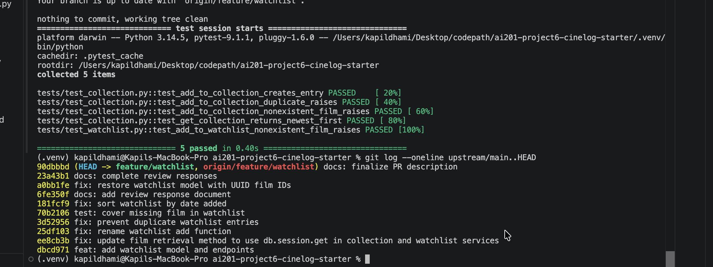

# PR Response Doc — CineLog Watchlist Feature

## AI Usage
I used ChatGPT to help me understand the project structure, explain the review comments, verify commands, and check that my changes followed the existing CineLog patterns. I reviewed the actual project code and test results before accepting each change.

## Comment 1 — Rename
**What I did:**  
I renamed `save_to_watchlist()` to `add_to_watchlist()` in `services/watchlist_service.py`. I also updated the import and function call in `routes/watchlist/watchlist.py`. This matches the existing `add_to_collection()` naming pattern.

**How I verified:**  
I searched the repository to confirm that `save_to_watchlist` no longer appeared in the source files. I then ran `python -m pytest tests/ -v`, and all 4 existing tests passed.

## Comment 2 — Deduplication
**What I did:**  
I added an `AlreadyInWatchlistError` and a duplicate check inside `add_to_watchlist()`. Before creating a new `WatchlistEntry`, the service now checks for an existing entry with the same `user_id` and `film_id`. If one already exists, the service raises the new error instead of creating a duplicate database row.

**How I verified:**  
I followed the same pattern used by `add_to_collection()` in `services/collection_service.py`. I then ran the full test suite with `python -m pytest tests/ -v`, and all 5 tests passed.

## Comment 3 — Missing test
**What I did:**  
I created `tests/test_watchlist.py` and added `test_add_to_watchlist_nonexistent_film_raises`. The test creates a sample user, uses a UUID that does not exist in the `Film` table, and verifies that `add_to_watchlist()` raises `FilmNotFoundError`.

**How I verified:**  
I ran the complete suite with `python -m pytest tests/ -v`. All 5 tests passed, including the new watchlist test.

## Comment 4 — Default visibility
**My position:**  
I would keep the default value as `public=True`.

**Reasoning:**  
CineLog is designed as a social film-tracking application where users discover movies through other users' activity. A public watchlist supports that goal because newly created watchlists are immediately shareable and visible without requiring additional setup. This creates a better default experience for discovery and engagement.

**Tradeoff acknowledged:**  
The downside is that some users may expect new watchlists to be private by default. A privacy-first default would reduce the risk of unintentionally sharing watchlist activity. However, because CineLog emphasizes social discovery, I believe a public default better matches the primary purpose of the platform.

## Comment 5 — Sort order
**My position:**  
I changed the watchlist order to date added, with the newest entries first.

**Reasoning:**  
A watchlist is mainly used to remember films a user wants to watch next. Recent additions are usually more relevant to the user's current interests, so showing them first makes the list easier to use. This also matches the existing `get_collection()` behavior, which already sorts by `date_added` descending.

**Engagement with reviewer's point:**  
I agree with the reviewer that newest-first is more useful than alphabetical order for the default view. Alphabetical sorting can help users find a known title in a long list, but recency better supports the main watchlist use case and keeps the behavior consistent across CineLog.

## Comment 6 — Rebase
**What conflicted:**  
The rebase first produced an add/add conflict in `.gitignore` because both updated `main` and my branch added that file. After the rebase completed, I also found that the watchlist model from the feature branch had not been preserved while `main` had migrated film IDs from integers to UUID strings.

**How I resolved it:**  
I combined the useful `.gitignore` entries and removed the conflict markers. I then restored `WatchlistEntry` in `models.py`, added its relationships to `User` and `Film`, and defined `film_id` as `db.String(36)` so it matches the UUID-based `Film.id` on updated `main`. I also updated the watchlist service and route documentation to describe film IDs as UUID strings.

**How I verified no conflict remains:**  
I ran `python -m pytest tests/ -v` and all 5 tests passed. I confirmed `git status` was clean and ran `git log --oneline --merges upstream/main..HEAD`, which returned no merge commits.

## PR Description

### Feature overview
This pull request adds a watchlist feature to CineLog so users can save films they want to watch later, separately from films they have already watched in their collection. It includes the `WatchlistEntry` model, service functions for adding and retrieving watchlist entries, REST endpoints, duplicate protection, missing-film validation, UUID-compatible film IDs, and automated testing.

### Design decisions
- **Default visibility:** New watchlist entries remain `public=True` because CineLog is a community-focused film application where public watchlists support sharing and film discovery. I acknowledge that this creates a privacy tradeoff for users who expect saved films to remain private.
- **Sort order:** Watchlist entries are sorted by `date_added` descending so recently saved films appear first. This supports the primary planning use case and matches the existing collection behavior.

### Manual testing steps
1. Create and activate the virtual environment:
   `python3 -m venv .venv && source .venv/bin/activate`
2. Install dependencies:
   `python -m pip install -r requirements.txt`
3. Run the complete test suite:
   `python -m pytest tests/ -v`
4. Start the Flask API:
   `python app.py`
5. Send a POST request to `/watchlist/<user_id>/add` with a valid film UUID.
6. Send a GET request to `/watchlist/<user_id>` and confirm the saved film appears.
7. Add the same film again and confirm the duplicate is rejected.
8. Submit an unknown film UUID and confirm the missing-film error is raised.

## Git Log Screenshot

